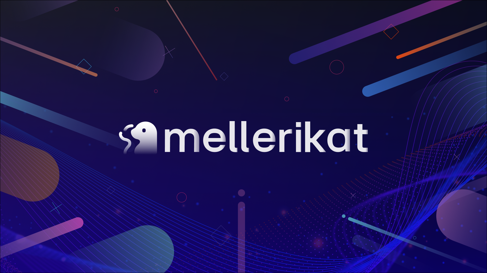

# Awesome AI Solutions for mellerikat 

    

🔥🔥🔥 Our Trending works

---

<b> Table of Contents </b> 

- [Awesome Solutions](#awesome-solutions)
  - [Multimodal Object Detection](#multimodal-object-detection)
  - [For Tabular Data](#solutions-for-tabular-data)
  - [For Timeseries Data](#solutions-for-timeseries-data)
  - [Foundation Model Based](#multimodal-in-context-learning)
  - [Others](#others)

---

# Awesome Solutions

## Multimodal Object Detection
|  Title  |   Solution builder  |   Date   |   Code   |   Demo   |
|:--------|:--------:|:--------:|:--------:|:--------:|
|     [**Zero-Shot Object Detection**](https://github.com/mellerihub/Awesome-AISolutions-for-mellerikat/blob/main/docs/zeroshot_objectdetection.md)   | LGE | 2025-01-26 | [Github](https://github.com/QwenLM/Qwen2.5-VL) | [Demo](https://huggingface.co/spaces/Qwen/Qwen2.5-VL) |
|     [**One-Shot Object Detection**](https://github.com/baichuan-inc/Baichuan-Omni-1.5/blob/main/baichuan_omni_1_5.pdf)   | LGE | 2025-01-26 | [Github](https://github.com/baichuan-inc/Baichuan-Omni-1.5) | Local Demo |
|     [**Labeling Automation for Object Detection**](https://arxiv.org/pdf/2412.10360)   | LGE | 2024-12-13 | - | Local Demo |

## Solutions For Tabular Data
|  Title  |   Soution builder  |   Date   |   Code   |   Demo   |
|:--------|:--------:|:--------:|:--------:|:--------:|
|     [**Tabular-Classification-Regression**](https://github.com/mellerihub/Awesome-AISolutions-for-mellerikat/blob/main/docs/tcr.md)   | LGE | 2024-02-12 | [Github](https://github.com/mellerikat-aicontents/Tabular-Classification-Regression) | Local Demo |
|     [**Tabular-Anomaly-Detection**](https://github.com/mellerihub/Awesome-AISolutions-for-mellerikat/blob/main/docs/tad.md)   | LGE | 2024-05-14 | [Github](https://github.com/mellerikat-aicontents/Tabular-Anomaly-Detection) | Local Demo |
|    [**Table-To-Text-Classification**](https://github.com/mellerihub/Awesome-AISolutions-for-mellerikat/blob/main/docs/table_to_text.md)   | POSTECH | 2024-12-13 | [Github](https://github.com/mellerihub/table-to-text) | Local Demo |

## Solutions For Timeseries Data
|  Title  |   Venue  |   Date   |   Code   |   Demo   |
|:--------|:--------:|:--------:|:--------:|:--------:|
|     [**Time Series Anomaly Detection**](https://github.com/mellerihub/Awesome-AISolutions-for-mellerikat/blob/main/docs/ad.md)   | LGE | 2024-04-14 | [Github](https://github.com/mellerikat-aicontents/Anomaly-Detection) | Local Demo |
|     [**Demand-Forecasting**](https://github.com/mellerihub/Awesome-AISolutions-for-mellerikat/blob/main/docs/demand_forecasting.md)   | arXiv | 2024-04-24 | [Github](https://github.com/mellerikat-aicontents/Demand_Forecasting) | Local Demo |
|    [**LTSF-Linear-Forecasting**](https://arxiv.org/pdf/2403.16999.pdf)   | arXiv | 2024-03-25 | [Github](https://github.com/deepcs233/Visual-CoT) | Local Demo |

## Foundation Models
|  Title  |   Venue  |   Date   |   Code   |   Demo   |
|:--------|:--------:|:--------:|:--------:|:--------:|
|    [**VideoLLaMA 3: Frontier Multimodal Foundation Models for Image and Video Understanding**](https://arxiv.org/pdf/2501.13106)   | arXiv | 2025-01-22 | [Github](https://github.com/DAMO-NLP-SG/VideoLLaMA3) | [Demo](https://huggingface.co/spaces/lixin4ever/VideoLLaMA3) |
|    [**Emu3: Next-Token Prediction is All You Need**](https://arxiv.org/pdf/2409.18869)   | arXiv | 2024-09-27 | [Github](https://github.com/baaivision/Emu3) | Local Demo |
| [**Llama 3.2: Revolutionizing edge AI and vision with open, customizable models**](https://ai.meta.com/blog/llama-3-2-connect-2024-vision-edge-mobile-devices/) | Meta | 2024-09-25 | - | [Demo](https://huggingface.co/meta-llama/Llama-3.2-11B-Vision-Instruct) | 
| [**Pixtral-12B**](https://mistral.ai/news/pixtral-12b/) | Mistral | 2024-09-17 | - | - |
|    [**xGen-MM (BLIP-3): A Family of Open Large Multimodal Models**](https://arxiv.org/pdf/2408.08872)   | arXiv | 2024-08-16 | [Github](https://github.com/salesforce/LAVIS/tree/xgen-mm) | - |
| [**The Llama 3 Herd of Models**](https://arxiv.org/pdf/2407.21783) | arXiv | 2024-07-31 | - | - |

## Others
|  Title  |   Venue  |   Date   |   Code   |   Demo   |
|:--------|:--------:|:--------:|:--------:|:--------:|
|    [**TS-LLaVA: Constructing Visual Tokens through Thumbnail-and-Sampling for Training-Free Video Large Language Models**](https://arxiv.org/pdf/2411.11066)   | arXiv | 2024-11-17 | [Github](https://github.com/tingyu215/TS-LLaVA) | - |
|    [**Safety Fine-Tuning at (Almost) No Cost: A Baseline for Vision Large Language Models**](https://arxiv.org/pdf/2402.02207.pdf)   | arXiv | 2024-02-03 | [Github](https://github.com/ys-zong/VLGuard) | - |
|    [**VCoder: Versatile Vision Encoders for Multimodal Large Language Models**](https://arxiv.org/pdf/2312.14233.pdf)   | arXiv | 2023-12-21 | [Github](https://github.com/SHI-Labs/VCoder) | Local Demo | 
|    [**Prompt Highlighter: Interactive Control for Multi-Modal LLMs**](https://arxiv.org/pdf/2312.04302.pdf)   | arXiv | 2023-12-07 | [Github](https://github.com/dvlab-research/Prompt-Highlighter) | - |
|    [**Planting a SEED of Vision in Large Language Model**](https://arxiv.org/pdf/2307.08041.pdf)   | arXiv | 2023-07-16 | [Github](https://github.com/AILab-CVC/SEED) |

---

