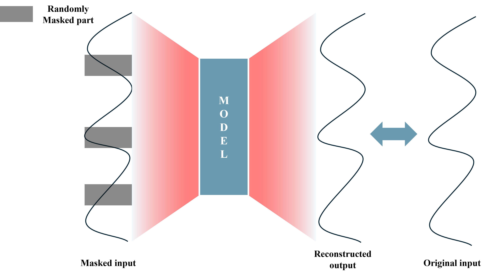
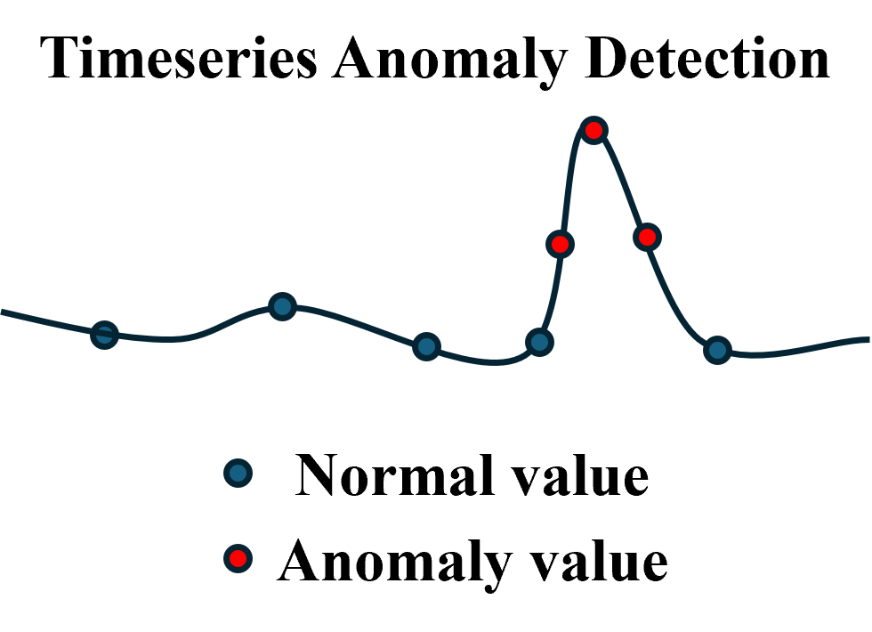

# 📖Solution

## What is foundation model?
Foundation models은 다양한 domain에 걸친 거대한 데이터 셋을 pre-train한 후, 이를 다양한 task에 맞게 fine-tuning하여 사용하는 모델을 의미합니다.

{width=75%}
## What is MOMENT?

MOMENT는 아래와 같이 embedding - encoding - reconstruction 구조를 가지고 있습니다.

{width=75%}

MOMENT는 input으로 time series와 해당 값이 관측값인지를 나타내는 masked vector를 받습니다.
이를 patch 단위로 나눈 뒤 embedding에서 각 patch를 D차원의 vector로 만듭니다.
해당 vector는 transformer로 구성된 encoder를 통해 time series의 특성을 학습하게 되고, 최종적으로 이를 활용하여 input time sereis를 reconstruction하게 됩니다.

MOMENT는 masked representation learning을 활용한 self-supervised learning을 통해 학습을 진행합니다.
Input으로 들어온 시계열에 random으로 masking한 후 이를 재구축하여, input 시계열과의 차이를 loss로 활용하여 학습을 진행합니다.
{width=50%}

git주소: https://github.com/moment-timeseries-foundation-model/moment


## What is MOMENT anomaly detection?
MOMENT anomaly detection 솔루션은 MOMENT라는 강력한 Foundation Model을 활용한 이상 탐지 솔루션입니다. MOMENT는 대규모 데이터셋을 사전 학습하여 일반적인 패턴과 지식을 학습하는 데 강점을 가지고 있습니다.  
특정 데이터셋에 맞춘 Fine-tuning을 통해 높은 성능을 달성하며, 범용성이 뛰어나 다양한 작업에 활용될 수 있습니다.  
해당 솔루션은 MOMENT를 활용해 단변량 시계열 데이터에서 이상치를 탐지하고, 재구축(reconstruction) 과정을 통해 이상 점수를 계산합니다. 또한, adjusted F1 score를 기준으로 최적의 임계값을 자동으로 설정합니다.

## When to use Anomaly Detection?
Anomaly Detection 적용이 가능한 분야는 다음과 같습니다.

{width=50%}

제조 과정 이상치 탐지: 제조 과정 모니터링 센서로 제조 과정 중 이상 발생 여부를 확인하려는 고객을 위한 기능입니다. 이상 발생 여부를 탐지하여 문제를 사전에 방지할 수 있습니다.

시계열 이상치 탐지: 제조 과정 뿐만 아니라 주식, 각종 추세 데이터 등 시계열 데이터에 대하여 이상치를 확인하고자 하는 고객입니다. 해당 이상치를 조기에 탐지하여 사용자는 적절한 조치를 취할 수 있게 됩니다.

---

## 주요 특징
**MOMENT 통합**

사전 학습된 MOMENT를 사용하여 빠르고 효율적으로 특정 작업에 적합한 모델을 Fine-tuning합니다.

**단변량 시계열 데이터 지원**

단변량 시계열 데이터에서 이상 탐지를 위한 솔루션입니다.

**재구축 기반 점수 계산**

시계열 데이터를 재구축해 이상 점수를 계산합니다.

**자동 임계값 설정**

학습 데이터셋의 adjusted F1 score를 기반으로 최적의 임계값을 설정합니다.

---

# 💡Features

## Pipeline

**Train pipeline**
```
Train
```


**Inference pipeline**
```
Inference
```
## Assets
**train asset**

학습 데이터셋에 대해 MOMENT를 Fine-tuning합니다

**inference asset**

테스트 데이터셋에 대해 추론을 진행 후, 각 timestamp에 대해 anomaly score와 anomaly 여부를 반환합니다

**anomaly_detection_dataset**

입력 데이터셋을 고정된 크기로 잘라 루프를 통해 반환합니다.

**anomaly_detection_metrics**

데이터셋에 대해 adjusted F1 score와 이에 따른 최적의 임계값을 계산합니다

---

## Experimental_plan.yaml

**데이터 경로 입력(external_path)**

train/test의 경로가 같은데, 그 이유는 하나의 dataset에서 시점을 기준으로 train/test를 나누기 때문입니다.
보통 Anomaly detection은 긴 하나의 시계열에 대해 수행하는 경우가 많기에 이와 같이 설정하였습니다

```
external_path:
    - load_train_data_path: ./solution/data
    - load_inference_data_path: ./solution/data
    - save_train_artifacts_path:
    - save_inference_artifacts_path:
    - load_model_path: 
```
| 파라미터명     | DEFAULT       | 설명 및 옵션       |
|-----------------|----------------|----------------|
| load_train_data_path | ./solution/data | train data의 경로 |
| load_inference_data_path | ./solution/data | test data의 경로 |

**사용자 파라미터(user_parameters)**
| 파라미터명     | DEFAULT       | 설명 및 옵션       |
|-----------------|----------------|----------------|
| task_name | "reconstruction" | MOMENT가 수행할 task, AD는 reconstruction 기반임 |
| data_name | "198_UCR_Anomaly_tiltAPB2_50000_124159_124985.out" | dataset 파일의 이름 |
| epoch | 10 | train 시 epoch의 수 |
| model_name | "anomaly_detection_model" | train으로 학습한 후 저장한 모델의 이름 |

# 📂Input and Artifacts
---
## 데이터 준비
---

**학습 데이터 준비**
1. 시간 순으로 정렬된 out파일을 준비합니다
2. 값이 정렬된 하나의 column과 해당 timestamp에서 anomaly 여부를 알려주는 label 2개의 column이 필요합니다
3. 파일 이름에서 4번쨰 "_" 이후의 숫자값이 train/test을 split하는 시점이 됩니다.

ex) 198_UCR_Anomaly_tiltAPB2_50000_124159_124985 => 50000 이전 시점 = train

**학습 데이터 예시**
| Value     | Label| 
|-----------------|----------------|
| 200.1 | 0.0| 
| 201.2 | 0.0| 
| 202.3 | 1.0|
| 203.4 | 0.0 |

## 데이터 요구사항
---

학습 데이터 준비에서도 적혀있 듯, 파일 이름을 통해 trian/test split을 진행합니다. 이 부분에 유의해 주시길 부탁드리겠습니다.

## 산출물
---

**Train pipeline**

```
./alo/train_artifacts
    └ models/train/
        └ anomaly_detection_model.pth
    └ output
        └ vali_result.csv
```
**Inference pipeline**

```
./alo/inference_artifacts
    └ output/
        └ result.csv
    └ extra_output/inference
        └ output.csv
```

**anomaly_detection_model.pth**

train 과정을 통해 fine tuning한 모델

**valie_result.csv**

train dataset의 f1-score와 threshold 결과

**result.csv**

수행한 task와 threshold

**output.csv**

time stamp의 anomaly score와 anomaly 여부


